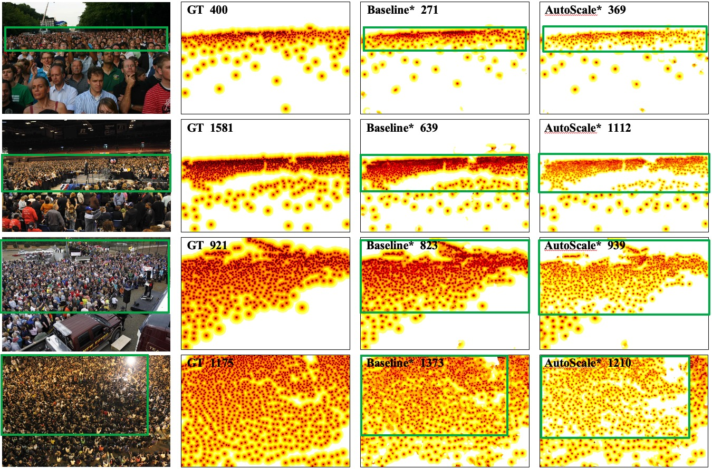
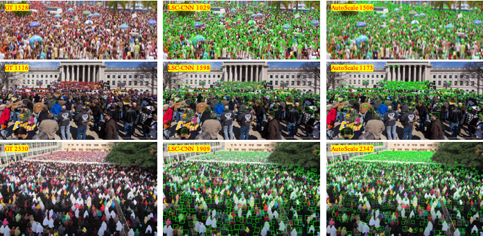

# AutoScale_localization
* An officical implementation of AutoScale localization-based method, you can find regression-based method from [here](https://github.com/dkliang-hust/AutoScale_regression). 
* [AutoScale](https://arxiv.org/abs/1912.09632) leverages a simple yet effective Learning to Scale (L2S) module to cope with significant scale variations in both regression and localization.<br />

# Structure
```
AutoScale_localization
|-- data            # generate target
|-- model           # model path 
|-- README.md       # README
|-- centerloss.py           
|-- config.py          
|-- dataset.py       
|-- find_contours.py           
|-- fpn.py         
|-- image.py
|-- make_npydata.py
|-- rate_model.py
|-- val.py        
```

# Visualizations
## Some localization-based results.


Qualitative visualization of distance label maps given by the proposed AutoScale.

## Result of detected person locations
.


Red points are the ground-truth. To more clearly present our localization results, we generate bounding boxes (green boxes) according to the KNN distance of each point, which follows and compares with LSC-CNN.

# Environment
python >=3.6 <br />
pytorch >=1.0 <br />
opencv-python >=4.0 <br />
scipy >=1.4.0 <br />
h5py >=2.10 <br />
pillow >=7.0.0<br />
imageio >=1.18

# Datasets
* Download ShanghaiTech dataset from [Baidu-Disk](https://pan.baidu.com/s/15WJ-Mm_B_2lY90uBZbsLwA), passward:cjnx <br />
* Download UCF-QNRF dataset from  [Google-Drive](https://drive.google.com/file/d/1fLZdOsOXlv2muNB_bXEW6t-IS9MRziL6/view)
* Download JHU-CROWD ++  dataset from [here](http://www.crowd-counting.com/)
* Download NWPU-CROWD dataset from [Baidu-Disk](https://pan.baidu.com/s/1VhFlS5row-ATReskMn5xTw), passward:3awa

# Generate target
```cd data```<br />
Edit "distance_generate_xx.py" to change the path to your original dataset folder.<br />
```python distance_generate_xx.py```

“xx” means the dataset name, including sh, jhu, qnrf, and  nwpu.

# Model
* QNRF [link](https://pan.baidu.com/s/1jHazRvt3tXbgRIdD-5yQJw), passward:bbpr
* NWPU [link](https://pan.baidu.com/s/1eCRi51uUCduIxet_fIEjcg), passward:gupa
* JHU [link](https://pan.baidu.com/s/16iE_VjlOfXZmV-cEkAl9Eg), passward:qr07
* ShanghaiA [link](https://pan.baidu.com/s/1k10W1__uh3Z93GDjpC-U_A), passward : ge32
* ShanghaiB [link](https://pan.baidu.com/s/1WWZ8I5Hi6ZtGXrzF617zjQ), passward : 2pq0

# Quickly test
* ```git clone https://github.com/dk-liang/AutoScale.git```<br />
```cd AutoScale```<br />
```chmod -R 777 ./count_localminma```<br />
* Download Dataset and Model

* Generate target

* Generate images list

Edit "make_npydata.py" to change the path to your original dataset folder.<br />
Run ```python make_npydata.py  ```

* Test <br />
```python val.py  --test_dataset qnrf  --pre ./model/QNRF/model_best.pth --gpu_id 0```<br />
```python val.py  --test_dataset jhu  --pre ./model/JHU/model_best.pth --gpu_id 0```<br />
```python val.py  --test_dataset nwpu  --pre ./model/NWPU/model_best.pth --gpu_id 0```<br />
```python val.py  --test_dataset ShanghaiA  --pre ./model/ShanghaiA/model_best.pth --gpu_id 0```<br />
```python val.py  --test_dataset ShanghaiB  --pre ./model/ShanghaiB/model_best.pth --gpu_id 0```<br />
More config information is  provided in ```config.py  ```

# Training
coming soon.

# References
If you are interested in AutoScale, please cite our work:
```
@article{xu2019autoscale,
  title={AutoScale: Learning to Scale for Crowd Counting},
  author={Xu, Chenfeng and Liang, Dingkang and Xu, Yongchao and Bai, Song and Zhan, Wei and Tomizuka, Masayoshi and Bai, Xiang},
  journal={arXiv preprint arXiv:1912.09632},
  year={2019}
}
```
and
```
@inproceedings{xu2019learn,
  title={Learn to Scale: Generating Multipolar Normalized Density Maps for Crowd Counting},
  author={Xu, Chenfeng and Qiu, Kai and Fu, Jianlong and Bai, Song and Xu, Yongchao and Bai, Xiang},
  booktitle={Proceedings of the IEEE International Conference on Computer Vision},
  pages={8382--8390},
  year={2019}
}
```


